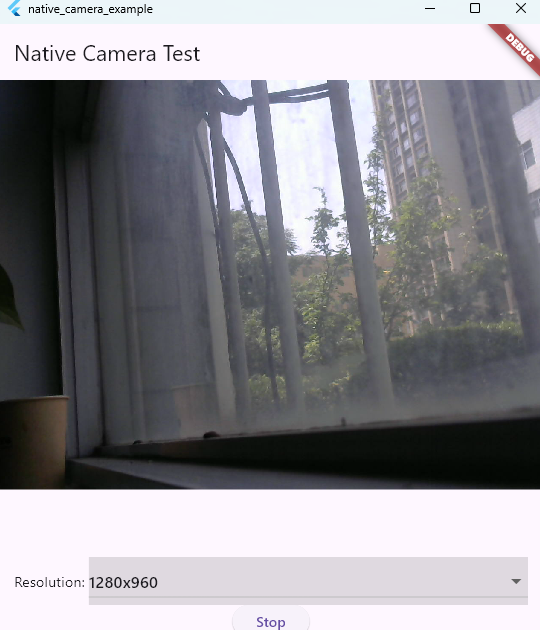

# native_camera

[](LICENSE)
[](https://github.com/5188good/native_camera)

High-performance Windows camera plugin for Flutter. Direct Media Foundation capture with NV12/YUY2 → BGRA software conversion — no IMFCaptureEngine, no Direct3D dependency, just raw frames delivered to your Dart code.

## Screenshot



## Why not camera_windows?

| | native_camera | camera_windows |
|---|---|---|
| Frame access | ✅ Raw BGRA bytes stream | ❌ Texture-only, no pixel access |
| Dependencies | Media Foundation (built-in) | D3D11 + IMFCaptureEngine |
| CPU usage | Low (software color convert) | Higher (GPU pipeline) |
| Resolution switching | ✅ Runtime, no restart | ❌ Fixed at init |
| Multi-camera | ✅ Runtime switch | ❌ Single camera |
| Image processing | ✅ Direct pixel access | ❌ Must screenshot texture |

If you need the raw pixel data for CV, ML, or custom processing — this is your plugin.

## Platform Support

| Platform | Status |
|---|---|
| Windows | ✅ Full support |
| macOS | 🚧 Planned |
| Linux | 🚧 Planned |
| Android/iOS | ❌ Use official `camera` plugin |

## Installation

```yaml
dependencies:
  native_camera:
    git:
      url: https://github.com/5188good/native_camera.git
```

## Quick Start

```dart
import 'package:native_camera/native_camera.dart';

// 1. List cameras
final cameras = await NativeCamera.getCameras();
print(cameras); // ['Logi C270 HD WebCam', ...]

// 2. Open camera 0
await NativeCamera.openCamera(0);

// 3. List supported resolutions
final resolutions = await NativeCamera.getResolutions(0);
// [{width: 1280, height: 720}, {width: 640, height: 480}, ...]

// 4. Set resolution (optional, default is native)
await NativeCamera.setResolution(640, 480);

// 5. Set FPS (optional, default 15, max 60)
await NativeCamera.setFps(30);

// 6. Start frame stream
final camera = NativeCamera();
camera.startStream().listen((frame) {
  // frame.width, frame.height, frame.rgbBytes (BGRA Uint8List)
  ui.decodeImageFromPixels(
    frame.rgbBytes, frame.width, frame.height,
    ui.PixelFormat.bgra8888,
    (image) => setState(() => _frame = image),
  );
});

// 7. Switch camera at runtime
await NativeCamera.switchCamera(1);

// 8. Stop
await camera.closeCamera();
```

## API Reference

### Static Methods

| Method | Returns | Description |
|---|---|---|
| `getCameras()` | `Future<List<String>>` | Enumerate connected cameras |
| `getResolutions(cameraIndex)` | `Future<List<CameraResolution>>` | List supported resolutions |
| `openCamera(index)` | `Future<String?>` | Open camera. Returns `null` on success |
| `setResolution(width, height)` | `Future<String?>` | Set resolution before streaming |
| `setFps(fps)` | `Future<int>` | Set frame rate (1-60). Returns actual value |
| `switchCamera(index)` | `Future<String?>` | Switch camera while streaming |
| `closeCamera()` | `Future<void>` | Close camera, stop stream |

### Instance Methods

| Method | Returns | Description |
|---|---|---|
| `startStream()` | `Stream<CameraFrame>` | Start frame delivery |
| `stopStream()` | `Future<void>` | Stop frame delivery |
| `dispose()` | `void` | Clean up resources |

### Data Types

```dart
class CameraFrame {
  final int width;
  final int height;
  final Uint8List rgbBytes; // BGRA8888
}

class CameraResolution {
  final int width;
  final int height;
}
```

## How It Works

```
Camera → IMFSourceReader → NV12/YUY2 Buffer
                                  ↓
                         IMF2DBuffer (real stride)
                                  ↓
                         Software NV12→BGRA
                                  ↓
                         EventChannel → Dart Stream<CameraFrame>
```

Key design decisions:

- **IMFSourceReader** over IMFCaptureEngine — simpler, fewer dependencies, direct buffer access
- **Software color conversion** — no GPU required, works on any Windows machine
- **IMF2DBuffer stride detection** — handles padded buffers (e.g. C270's 1024-byte stride for 640-wide frames)
- **mutex-protected event sink** — thread-safe frame delivery to Flutter

## Building the Example

```bash
cd example
flutter build windows --debug
# Output: build/windows/x64/runner/Debug/native_camera_example.exe
```

## License

MIT
